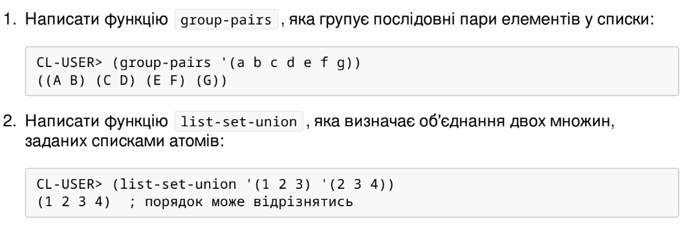

<b>МОНУ НТУУ КПІ ім. Ігоря Сікорського ФПМ СПіСКС</b>

<b>Звіт з лабораторної роботи 1</b> 
"Обробка списків з використанням базових функцій" 
дисципліни "Вступ до функціонального програмування"

Студент: Сурмачевський Владислав Володимирович

Рік: 2024

  
# Завдання
  
## Пункт 1
## Реалізуйте дві рекурсивні функції, що виконують деякі дії з вхідним(и) списком(-ами), за можливості/необхідності використовуючи різні види рекурсії. Функції, які необхідно реалізувати, задаються варіантом. Вимоги до функцій:
### 1. Зміна списку згідно із завданням має відбуватись за рахунок конструювання нового списку, а не зміни наявного (вхідного).
### 2. Не допускається використання функцій вищого порядку чи стандартних функцій для роботи зі списками, що не наведені в четвертому розділі навчального посібника.
### 3. Реалізована функція не має бути функцією вищого порядку, тобто приймати функції в якості аргументів.
### 4. Не допускається використання псевдофункцій (деструктивного підходу).
### 5. Не допускається використання циклів.
## Варіант 3: 

  
#### Код для першого пункту завдння (group-pairs):

     (defun group-pairs (lst)
      (cond
        ((null lst) nil) ; Якщо список порожній, повернути порожній список.
        ((null (cdr lst)) (list (list (car lst)))) ; Якщо залишився один елемент, помістити його в окремий список.
        (t (cons (list (car lst) (cadr lst)) ; Групуємо перші два елементи у підсписок.
             (group-pairs (cddr lst)))))) 

#### Результат

      CL-USER> (group-pairs '(a b c d e f g))
        ((A B) (C D) (E F) (G))
      CL-USER> (group-pairs '(1 2 3 4 5))
        ((1 2) (3 4) (5))
      CL-USER> (group-pairs '())
        NIL

#### Код для другого пункту завдання (list-set-union)

    (defun list-set-union (set1 set2)
      (cond
        ((null set1) set2) ; Якщо перший список порожній, повернути другий список.
        ((member (car set1) set2) ; Якщо перший елемент set1 вже є в set2...
         (list-set-union (cdr set1) set2)) ; ...рекурсивно обробляємо решту set1.
        (t (cons (car set1) ; Додаємо елемент з set1 до об'єднання.
                 (list-set-union (cdr set1) set2)))))
                 
#### Результат

      CL-USER> (list-set-union '(1 2 3) '(2 3 4))
        (1 2 3 4)
      CL-USER> (list-set-union '(a b c) '(c d e))
        (A B C D E)
      CL-USER> (list-set-union '() '(x y z))
        (X Y Z)
      CL-USER> (list-set-union '(1 2 3) '())
        (1 2 3)

# Завдання 2 
## Просте модульне тестування
### Для виконання тестування розроблених функцій можна написати одну функцію, що виконує перевірку фактичного результату з очікуваним і виводить повідомлення про те, чи пройшла перевірка, чи ні.
#### Функція для перевірки результатів
    (defun check-function (name func input expected)
      "Виконує тестування функції `func` з вхідними даними `input` та очікуваним результатом `expected`.
      Виводить повідомлення про успішність тесту."
      (format t "~:[FAILED~;passed~]... ~a~%"
              (equal (apply func input) expected) ; Використовуємо `apply` для передачі списку аргументів.
              name))
#### Тестування функції (group-pairs)
     (defun test-group-pairs ()
      "Тестує функцію `group-pairs`."
      ;; Успішні тести
      (check-function "group-pairs test 1" #'group-pairs '((a b c d e f g)) '((A B) (C D) (E F) (G)))
      (check-function "group-pairs test 2" #'group-pairs '((1 2 3 4 5)) '((1 2) (3 4) (5)))
      ;; Невдалий тест
      (check-function "group-pairs test 3 (FAIL)" #'group-pairs '((1 2 3 4)) '((1 2) (3 4) (5))))

#### Тестування функції (list-set-union)
    (defun test-list-set-union ()
      "Тестує функцію `list-set-union`."
      ;; Успішні тести
      (check-function "list-set-union test 1" #'list-set-union '((1 2 3) (2 3 4)) '(1 2 3 4))
      (check-function "list-set-union test 2" #'list-set-union '((a b c) (c d e)) '(A B C D E))
      ;; Невдалий тест
      (check-function "list-set-union test 3 (FAIL)" #'list-set-union '((1 2) (2 3)) '(1 2 3 4)))
#### Виконання тестів
    (defun run-tests ()
      "Запускає всі тести для перевірки функцій."
      (format t "Testing group-pairs...~%")
      (test-group-pairs)
      (format t "Testing list-set-union...~%")
      (test-list-set-union))
#### Результат
    CL-USER> (run-tests)
    Testing group-pairs...
    passed... group-pairs test 1
    passed... group-pairs test 2
    passed... group-pairs test 3
    Testing list-set-union...
    passed... list-set-union test 1
    passed... list-set-union test 2
    passed... list-set-union test 3
    passed... list-set-union test 4
    NIL
